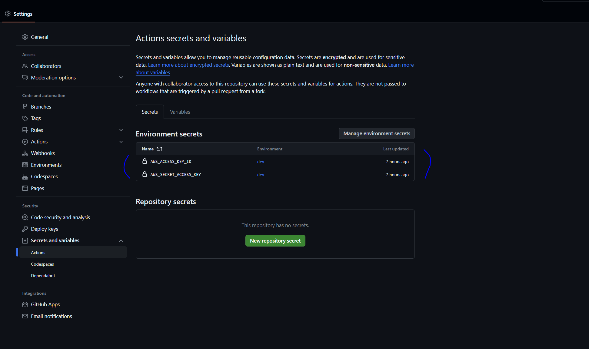
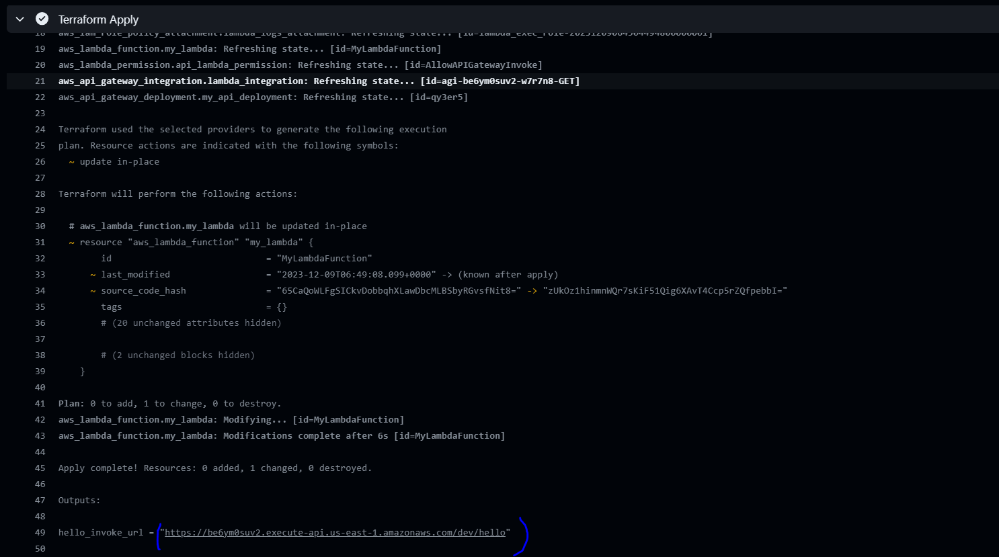

# Deploying a `Hello World` API using `Terraform` and `Github Actions`(CI/CD)

This guide outlines the steps to create an S3 bucket for storing Terraform state files using the AWS CLI. It also covers optional steps for setting up state locking with DynamoDB.

## Prerequisites

- AWS CLI installed and configured with necessary permissions.
- An AWS account with permissions to create S3 buckets and DynamoDB tables (if using state locking).

## Installation and Configuration

### Step 1: Configure AWS CLI

Ensure AWS CLI is installed and configured with your credentials:

```bash
aws configure
```

### Step 2:  Create S3 Bucket to store the Terraform State file
S3 bucket name should be globally unique.Make sure to use a unique bucket name.

```bash
aws s3 mb s3://chathra-tfstate-bkt --region us-east-1
```

### Step 3:  Enable Versioning
Enable versioning on your S3 bucket to keep the history of your state files:

```bash
aws s3api put-bucket-versioning --bucket chathra-tfstate-bkt --versioning-configuration Status=Enabled
```

### Step 4: Set Up DynamoDB for State Locking (Optional)
If you want to use state locking, create a DynamoDB table:

```bash
aws dynamodb create-table \
    --table-name my-lock-table \
    --attribute-definitions AttributeName=LockID,AttributeType=S \
    --key-schema AttributeName=LockID,KeyType=HASH \
    --billing-mode PAY_PER_REQUEST
```

### Step 5: Configure Terraform Backend
Add the following backend configuration in ```providers.tf```

```bash
terraform {
  backend "s3" {
    bucket         = "my-terraform-state-bucket" # use the same bucket name used in step 2
    key            = "terraform.tfstate" 
    region         = "us-east-1"
    dynamodb_table = "my-lock-table" # optional (Only if you created the DynamoDB table in step 4) 
  }
}
```

### Step 6: Create a new Github repository and set following secrets in development enviroment
This step will ensure github actions can authenticate and deploy the resources in AWS using Terraform.Your IAM user should have sufficient permissions in AWS. The ```AWS_ACCESS_KEY_ID``` and ```AWS_SECRET_ACCESS_KEY``` should be the security credentials of your AWS account user.




### Step 7: Once you prepare the code locally and commited to the local git repository, push it to the new repository that you created in Step 6, so it should trigger Github actions(CI/CD pipeline)

```bash
git remote set-url origin  <your new remote repo url(step 6)> 
git push origin main
```


### Step 8: Access the deployed API



# Tharindu_Inf_lab2

# Tharindu_Inf_lab2

# Tharindu_Inf_lab2

# Tharindu-sltc-lab-2-test

